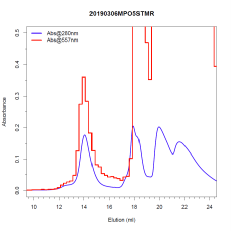

# Combine the data from FPLC and BioTEK Plate Reader to form the chromatograph.

Data from FPLC was exported as a text file with an extension of "ASC". Data from the BioTEX was exported as an Excel file. 

## readBioTek.R is a test of ReadXLSX package to directly read from the Excel file.

In practice, the plate reader could read data at multiple wavelengthes. Thus, I found it is easier to open the Excel file for reviewing, choose the data block and copy the plate data wanted to clipboard. Then, read the clipboard in the R script.

### A typical result figure
